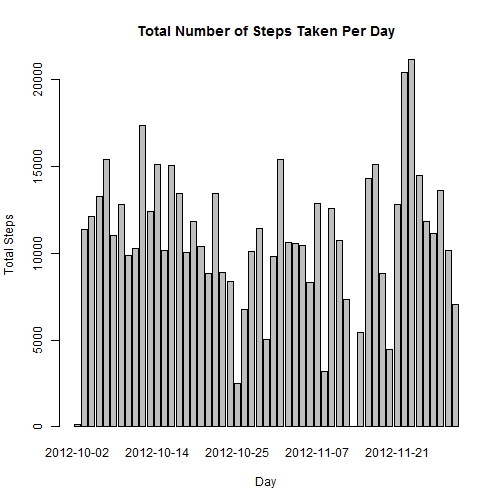
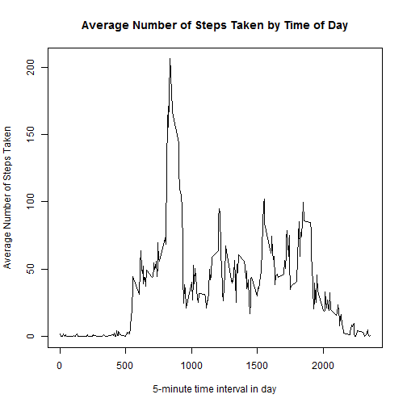
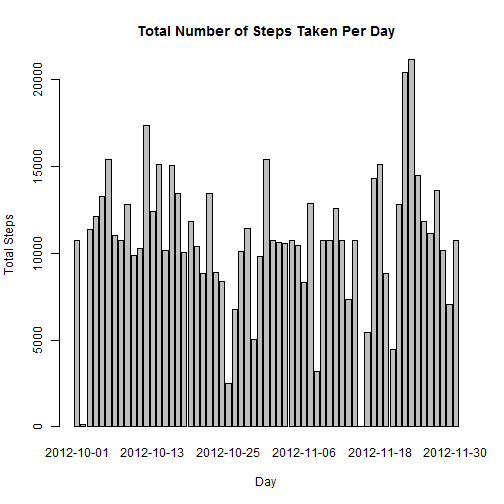
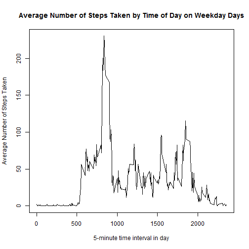
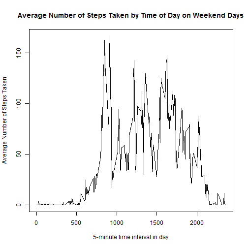

Loading and preprocessing the data

1.  Load the data.  In this first Peer Assessment Assignment, we first read the data from the file "activity.csv":


```r
Data <- read.csv("C:/Users/jcosta/Documents/Data Science/Reproducible Research/RepData_PeerAssessment1/activity/activity.csv")
```

2.  Process/transform the data (if necessary).  I found preprocessing to be unnecessary.

What is mean total number of steps taken per day?

For this part of the assignment, missing values are ignored.

1.  Calculate the total number of steps taken per day.

The total number of steps taken per day is calculated using the following code chunk:


```r
TotalSteps <- aggregate(Data$steps ~ Data$date, Data, sum)
```

2.  Make a histogram of the total number of steps taken per day.  The histogram is created using the following code chunk:

```r
barplot(TotalSteps$`Data$steps`, names.arg = TotalSteps$`Data$date`, main = "Total Number of Steps Taken Per Day", xlab = "Day", ylab = "Total Steps")
```

 

3.  Calculate and report the mean and median of the total number of steps taken per day.  
  
  The mean number of steps per day is calculated using the following code chunk:

```r
mean(TotalSteps$`Data$steps`)
```

```
## [1] 10766.19
```

The median number of steps per day is calculated using the following code chunk:

```r
median(TotalSteps$`Data$steps`)
```

```
## [1] 10765
```

What is the average daily activity pattern?

1.  Make a time series plot of the 5-minute interval (x-axis) and the average number of steps taken, averaged across all days (y-axis).

First, aggregate the data to find the average number of steps per 5-minute interval, using the following code:


```r
aggStepsByInterval <- aggregate(Data$steps ~ Data$interval, Data, mean)
```

Now, plot the time series using the following code:

```r
plot(aggStepsByInterval$`Data$interval`, aggStepsByInterval$`Data$steps`, type="l", main = "Average Number of Steps Taken by Time of Day", xlab = "5-minute time interval in day", ylab =  "Average Number of Steps Taken")
```

 

2.  Which 5-minute interval, on average across all the days in teh data set, contains the highest number of steps?

The 5-minute interval that on-average across all the days in the data set contains the highest number of steps is calculated as follows:


```r
aggStepsByInterval$`Data$interval`[which.max(aggStepsByInterval$`Data$steps`)]
```

```
## [1] 835
```

Inputting missing values

1.  Calculate and report the total number of missing values in the data set.

The number of missing values contained in the data set is calculated using the following code:


```r
sum(is.na(Data$steps)) + sum(is.na(Data$date)) + sum(is.na((Data$interval)))
```

```
## [1] 2304
```

2.  Devise a strategy for filling in all of the missing data.

In this assignment, missing data values are dealt with by replacing NA's with the average number of steps for the given time interval calculated over all days, as calculated above.  

3.  Create a new data set that is equal to the original data set, but with missing values filled in.  To do this, a new data set is created, filling in the average number of steps for that 5-minute interval for each missing data for any given interval, using the following code:


```r
NewData <- merge(Data, aggStepsByInterval, by.x = "interval", by.y = "Data$interval")
NewData$steps[which(is.na(NewData$steps))] <- NewData$`Data$steps`[which(is.na(NewData$steps))]
```

4.  Make a histogram of the total number of steps taken each day, and calculate and report the mean and median total number of steps taken each day.  Create a new histogram and mean and median to compare against the original data set:


```r
TotalSteps2 <- aggregate(NewData$steps ~ NewData$date, NewData, sum)
barplot(TotalSteps2$`NewData$steps`, names.arg = TotalSteps2$`NewData$date`, main = "Total Number of Steps Taken Per Day", xlab = "Day", ylab = "Total Steps")
```

 

The mean number of steps per day is calculated using the following code chunk:

```r
mean(TotalSteps2$`NewData$steps`)
```

```
## [1] 10766.19
```

The median number of steps per day is calculated using the following code chunk:

```r
median(TotalSteps2$`NewData$steps`)
```

```
## [1] 10766.19
```

Do these values differ from the from the estimates from the first part of the assignment?  The histogram is a bit different because in the original dataset there were several full days of missing data.  The new histogram has these days filled in, with each 5-minute interval filled in with the mean value for that 5-minute interval.  Because we are filling in data with the mean value itself, the mean and median for the new (filled-in) dataset remains in line with the mean and median of the original dataset.


Are there any differences in activity patterns between weekdays and weekends?

For this part of the Assignment, the data set containing the average values filled in for the missing data is used.

1.  Create a new factor variable in the dataset with two levels - "weekday" and "weekend" indicating whether a given date is a weekday or a weekend.

A new factor variable is added to the data set, containing two levels - "weekday" and "weekend", using the following code chunk:


```r
NewData$date <- as.Date(NewData$date)
weekend <- c("Saturday", "Sunday")
NewData$DayOfWeek <- factor((weekdays(NewData$date, abbreviate = FALSE) %in% weekend), levels=c(FALSE, TRUE), labels=c("weekday", "weekend"))
```

2.  Make a panel plot containing a time series plot of the 5-minute interval (x-axis) and the average number of steps taken, averaged across all weekday days or weekend days (y-axis)

First subset and weekday days and weekend days using the following code:


```r
weekdayDays <- subset(NewData, NewData$DayOfWeek == "weekday")

weekendDays <- subset(NewData, NewData$DayOfWeek == "weekend")
```

Next, aggregate the data to find the average number of steps per 5-minute interval across weekday days and across weekend days, using the following code:


```r
aggStepsByIntervalWDdays <- aggregate(weekdayDays$steps ~ weekdayDays$interval, weekdayDays, mean)

aggStepsByIntervalWEdays <- aggregate(weekendDays$steps ~ weekendDays$interval, weekendDays, mean)
```

Now we can plot the time series using the following code:

```r
plot(aggStepsByIntervalWDdays$`weekdayDays$interval`, aggStepsByIntervalWDdays$`weekdayDays$steps`, type="l", main = "Average Number of Steps Taken by Time of Day on Weekday Days", xlab = "5-minute time interval in day", ylab =  "Average Number of Steps Taken")
```

 

```r
plot(aggStepsByIntervalWEdays$`weekendDays$interval`, aggStepsByIntervalWEdays$`weekendDays$steps`, type="l", main = "Average Number of Steps Taken by Time of Day on Weekend Days", xlab = "5-minute time interval in day", ylab =  "Average Number of Steps Taken")
```

 
 
As is clear from the above charts, the individual from whom the data was taken is active earlier during weekdays, but is more active overall (i.e., throughout the day) on weekends.
